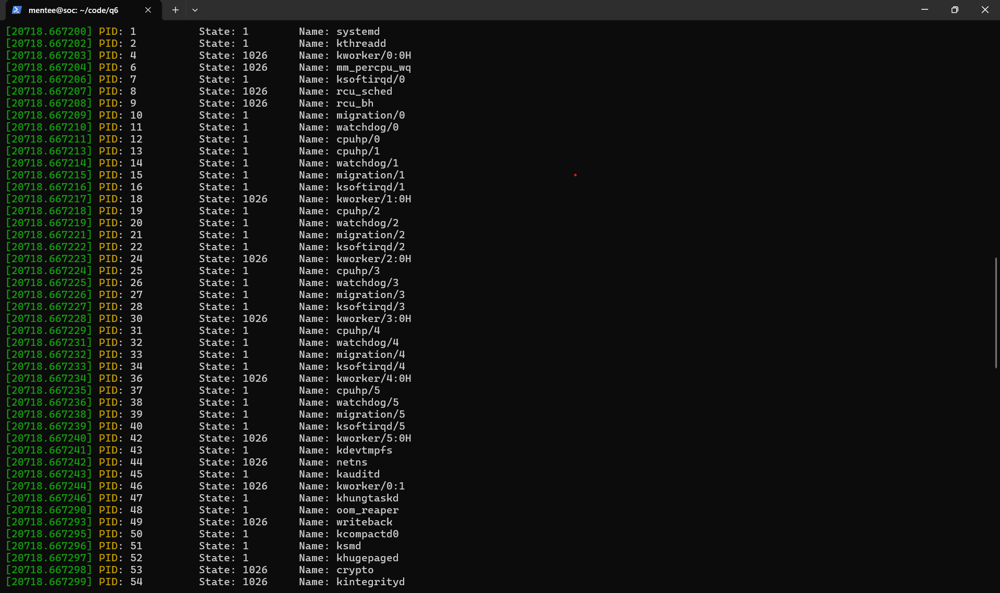

# Solutions to Assignment 1

## Q1

### a

Processor is a logical CPU. That is, the number 0, 1, 2 etc. represents which logical CPU we're looking at. A logical CPU is within a physical CPU. There may be one or more logical CPUs per physical CPU core. Each core has a certain number of threads. A CPU core can work on any one of these or multiple of these at the same time - called Hyperthreading. Therefore, each core-thread combination is a logical core - meaning it's done in software.

Core is a physical entitity on the CPU chip itself. It tells us how many cores our physical CPU has. Each core is capable of working independently.

### b

My VM shows a total of 6 cores.  
 `more /proc/cpuinfo | grep "^cpu cores" | uniq`

### c

My VM shows a total of 6 processors.  
 `more /proc/cpuinfo | grep "^processor"`

### d

Frequency of each processor is 2803.2 MHz.  
`more /proc/cpuinfo | grep "^cpu MHz"`

### e

x86_64  
`lscpu | grep "Architecture"`

### f

4040224 kB  
`more /proc/meminfo | grep "MemTotal"`

### g

3640304 kB  
`more /proc/meminfo | grep "MemFree"`

### h

Total number of forks: 2425

- `cat /proc/stat | grep "processes"`  

Total number of context switches: 558162

- `cat /proc/stat | grep "ctxt"`

---  

## Q2

### a  
PID of the process is 2528

### b
CPU: 99%  
Memory: 0%

### c
The process is currently running (`R+`). `+` indicates that its' running in the foreground of the terminal.

### `ps aux | grep "./cpu"`

---

## Q3

Program 1 `memory1.c` has:  
`8296 KB` of virtual memory allocated.  
`808 kB` of physical memory actually used on disk.  
`187 kB` is size of heap+uninitialized memory.  
`3912 kB` is size of stack.  
  
Program 2 `memory2.c` has:  
`8296 kB` of virtual memory allocated.  
`3292 kB` of physical memory actually used on disk.  
`186 kB` is size of heap+uninitialized memory.   
`3916 kb` is size of stack.  
  
Both the programs are allotted the same amount of virtual memory by the OS. But we can see that `memory1.c` occupies much less physical memory on the disk than `memory2.c`. This is because, in `memory2.c` we are actually initializing the array with some integer values whereas in `memory1.c`, the memory is just allotted on the stack and we're not initializing it with any values.

---

## Q6

